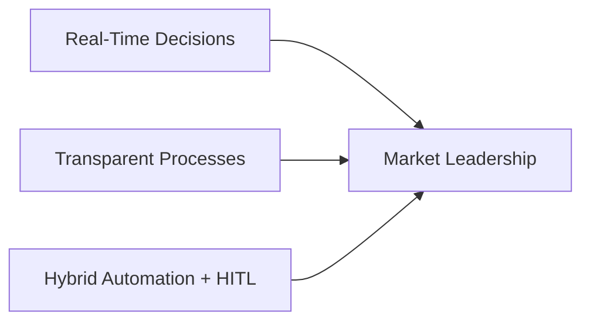
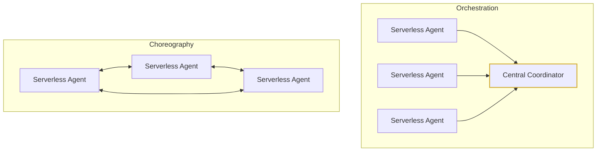

# Business Scenario: TravelCorp Modernization

## Executive Summary
**TravelCorp** is a mid-sized corporate travel management company facing operational bottlenecks due to legacy, manual workflows. To maintain market differentiation and meet modern enterprise expectations, the company is transitioning to an **event-driven, multi-agent architecture** on AWS.

## Market Footprint & Scale
* **Enterprise Clients:** 200+ active corporate accounts.
* **Volume:** 50,000+ flight bookings processed annually.
* **Target:** Transition from high-touch manual processing to an automated, intelligent, and scalable booking platform.

## Current State vs. Future Vision

### The Legacy Problem (Sequential & Manual)
* **Ingestion:** Travel agents receive booking requests through fragmented channels (email/phone).
* **Research:** Staff manually look up weather conditions on various external websites.
* **Sourcing:** Agents log into multiple airline portals to manually compare flight options.
* **Approvals:** Governance is handled through lengthy, slow-moving email chains.

### Core Bottlenecks
* Creates severe operational backlogs during high-demand peak travel periods.
* Limits the ability to provide instant, real-time responses.
* Lacks the transparent, intelligent processing that modern enterprises expect.

---

## The Strategic Opportunity
TravelCorp aims to differentiate itself in the corporate travel market by introducing an event-driven system built on **three core pillars**:

* **Real-Time Decision-Making:** Moving from batch/sequential processing to instantaneous event reactions.
* **Transparent Processes:** Clear visibility into data pipelines, giving corporate clients instant updates on their travel status.
* **Hybrid Automation (HITL):** Automating routine data aggregation (weather, flight comparisons) while cleanly routing high-risk or high-cost scenarios to human experts via **Human-in-the-Loop (HITL)** workflows.

# Multi-Agent Coordination Patterns

You will build the same multi-agent system twice, each time applying a different coordination pattern:

## Pattern Breakdowns

* **Choreography**
  * Agents communicate through events using **Amazon EventBridge** and **AWS Lambda**.
  * This approach emphasizes **loose coupling** and **flexibility**.
* **Orchestration**
  * Agents are coordinated centrally using **AWS Step Functions** and **AWS Lambda**.
  * This approach emphasizes **visibility**, **control**, and **state management**.

By completing both implementations, you will understand the trade-offs between the two patterns and learn how to choose the right model for your applications.
